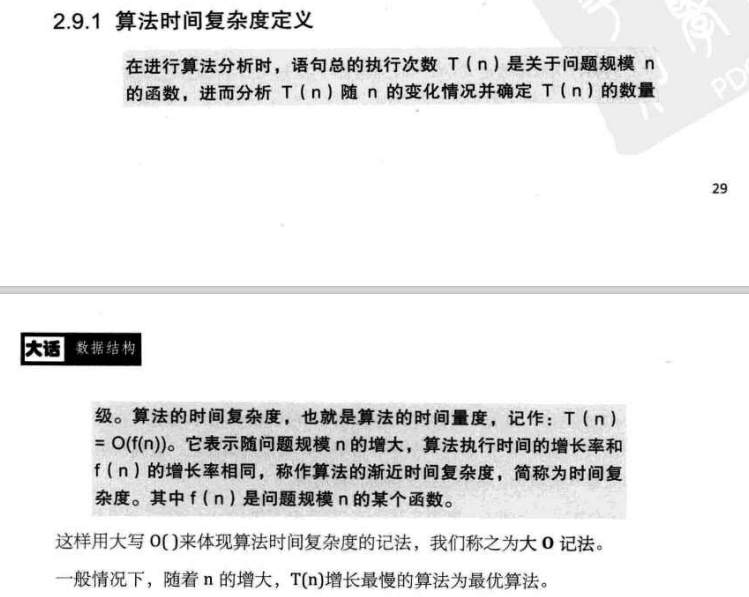

### 算法  
- 概念  
  算法是解决特定问题  求解步骤的描述，在计算机中表现为指令的有限序列，每个指令表示一个或多个操作  
  
- 算法特性     
  输入，输出，确认，可性，有穷  
  
- 算法设计要求   
  正确性、可读性、健壮性、效率高【执行时间最短】，低存储【运行时占用内存存储最低】  
  
  
- 算法效率度量  
    - 事后估算，先设计好代码和测试数据再来测算效率  
    - 事先计算效率【主要是看操作次数，机器指令的执行次数】     
    
- 算法时间复杂度   
         
    