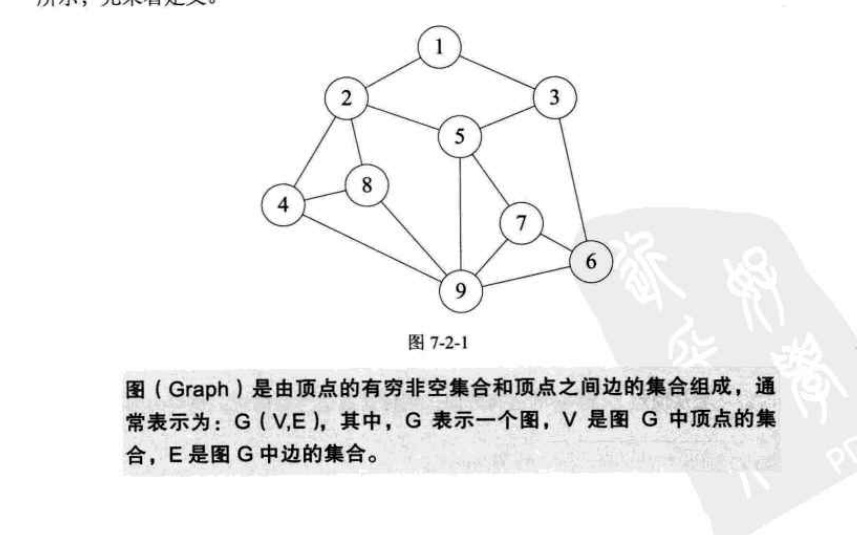
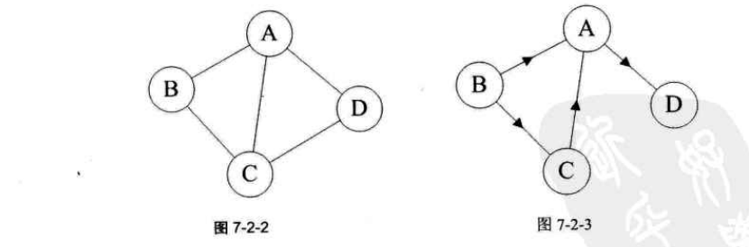

### 图  
- 定义  
      
    图是顶点的集合和顶点边的集合组成   
    
    1、线性结构中数据元素称为元素，树中称为结点，图中称为顶点  
    2、线性表中没有元素称为空表，树称为空树，图不允许没有顶点  
    3、线性表中相邻的数据元素具有线性关系，树中具有层次关系，图中的逻辑关系用边表示   
    
    
- 各种图的定义  
    - 无向图、有向图，无向边，有向边  
    