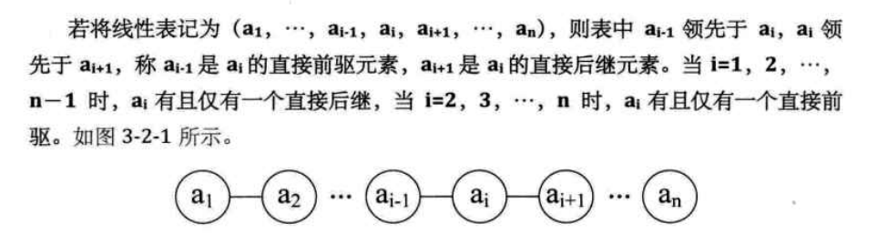
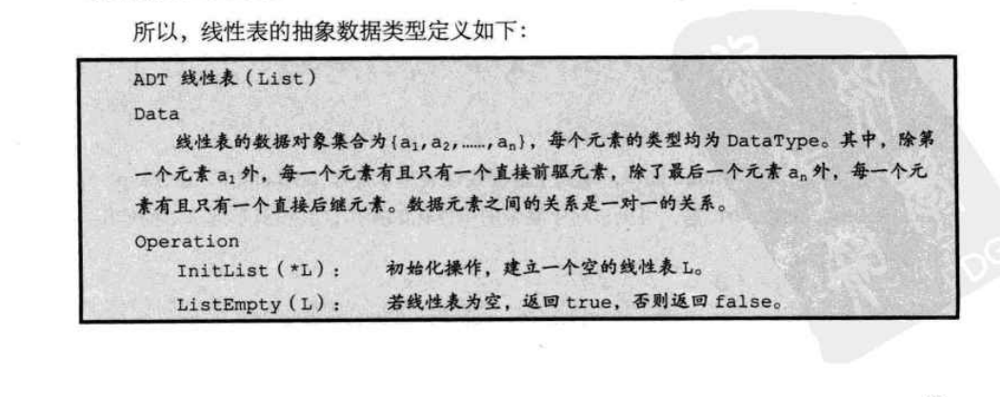
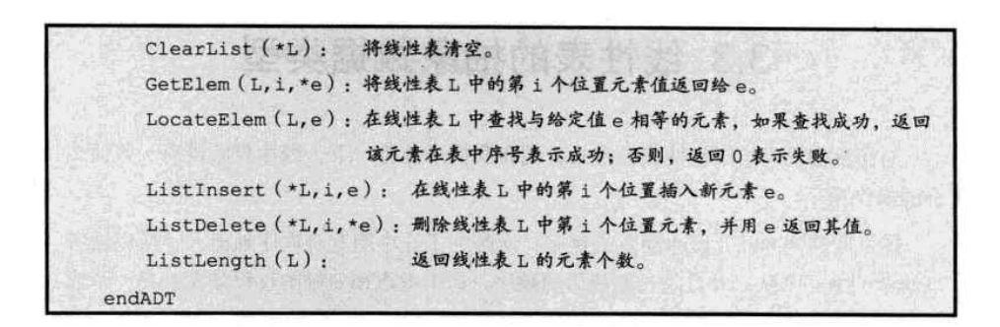
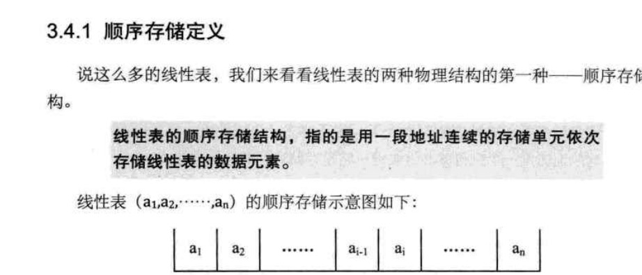
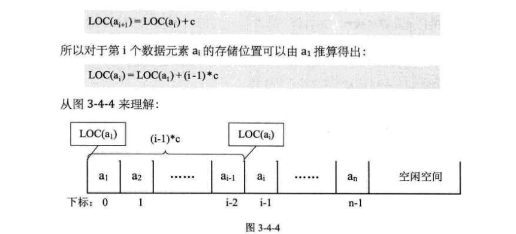
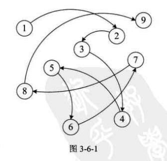

### 线性表  
- 定义  
  线性表LIST：是0个或多个的数据元素的有限序列    
  
  图
    
  
  线性表元素n(n>=0)的个数线性表的长度，没有元素的为空表  
  非空表中的每个元素都有自己的位置，a1为第一个数据元素，an为最后一个数据元素  
  ai为第i个数据元素，称i为ai在线性表中的位序  
  
  
- 线性表的抽象数据类型   

    
      
    
- 线性表的数据存储顺序    
    线性表的顺序存储结构，指的是用一连续内存存储单元依次存储线性表的数据元素   
       
    
    [顺序存储方式](list.c)

      
    
- 线性表的数据元素插入和删除  
    [数据元素插入和删除](list.c)  
    
- 线性表的优缺点   
        
    插入和删除元素要移动大量的数据元素，效率低下！O(n)太高   
    
- 线性表的链式存储结构     

  - 定义：  
  用任意的存储单元去存储线性表的数据元素，存储单元可以是连续的，也可以不是连续的   
       
  
  为了表示数据元素ai和数据元素ai+1的逻辑关系，存储单元不但要存储数据元素本身  
  还要存储后继元素的位置，存储数据元素的域称为数据域，存储后继元素位置的域称为  
  指针域，两者互相结合构成数据元素ai的映像，称为结点Node  
  
  n个结点（ai的存储映像）链结成一个链表，就称为线性表(a1,a2,ai,an)的链式存储结构   
  
  
  链表中每个结点都有指针域，称为单链表，单链表通过每个结点的指针域将线性表中的  
  数据元素按其逻辑次序链接在一起   
  
