### 树  
- 定义  
    树【tree】是n个结点的有限集.  
    n=0为空树，n>1时有一个根结点Root  
    当n>1时，其余结点可以分为m(m>0)个结点的有限集，T1,T2,...它们每个集合也是树，称为根结点的子树   
    【Substree】  
    
    图示  
    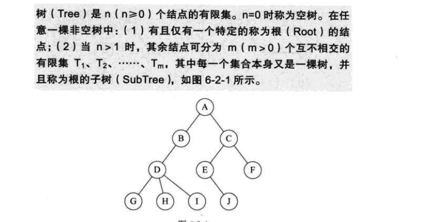  
- 结点分类   

    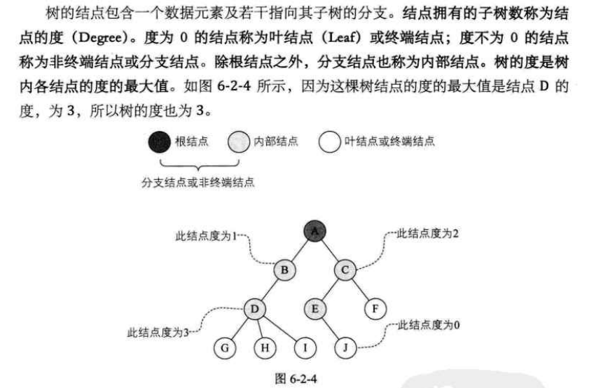   
    
    子结点的子树数称为节点的度，节点的度为0则是终端节点或叶节点  
    节点度不为0的分支结点或非终端节点，分支结点也称为内部结点  
    树的度是指树内各结点度的最大值     
    
- 结点间的关系  
    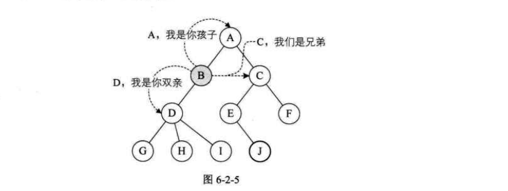  
    
- 树的层次  
    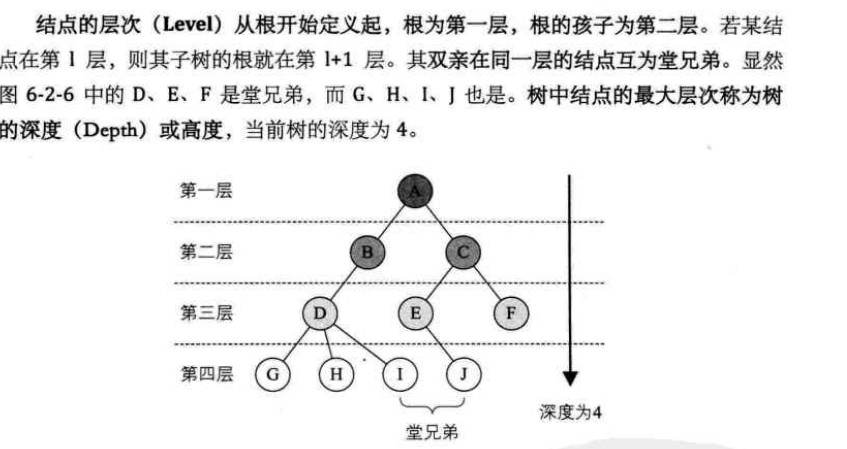  
    
- 树的存储结构  
    双亲表示法，孩子表示法，孩子兄弟表示法    
    
- 双亲表示法  
    
    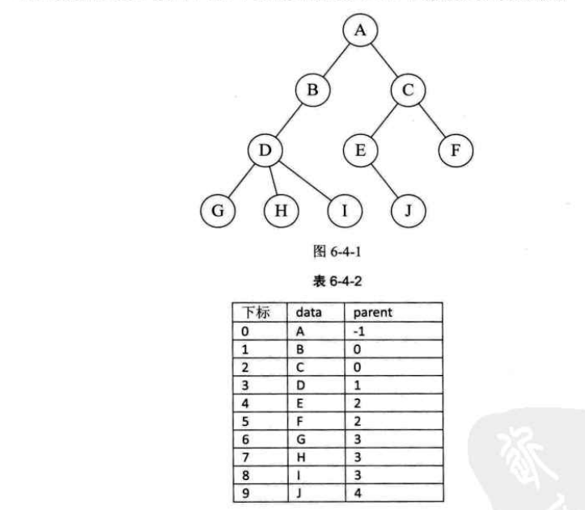  
    节点结构存在双亲域，长子域，兄弟域    
    
    长子域  
    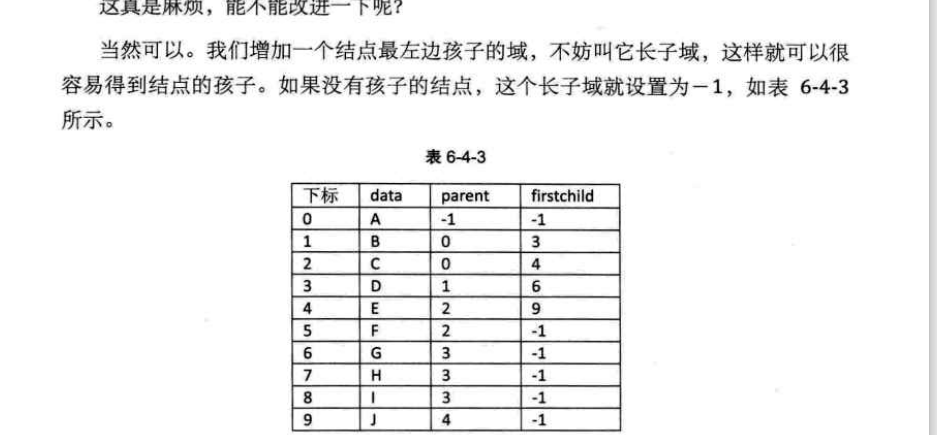   
    
    兄弟域  
    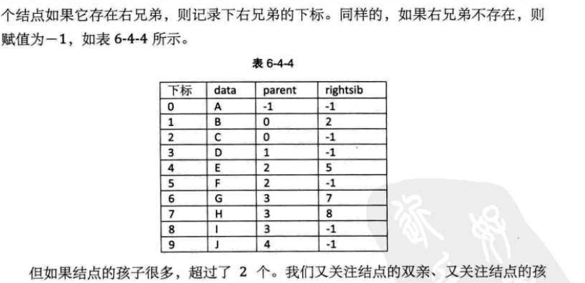    
    
    [测试源码](tree1.c)
    
    
- 孩子表示法   
    每个结点有多个指针域，每个指针指向一棵了树的根结点  
    又叫双重链表表示法   
    
    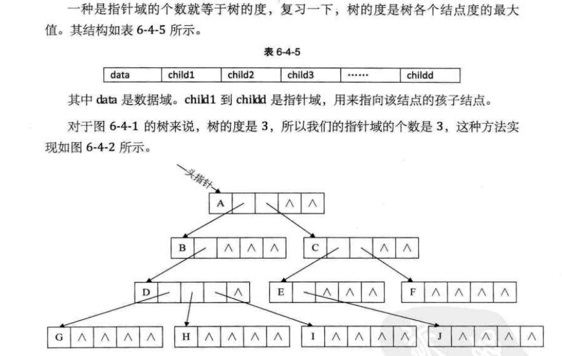    
    
    每个结点多出了一个度域+多个指针域，度域个数决定指针域个数
    指针指向每棵子树的根结点  
    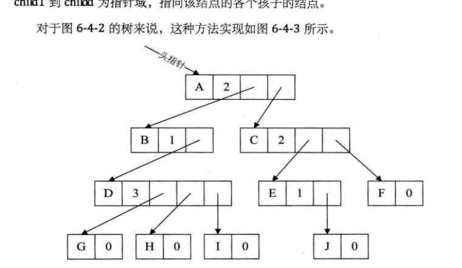  
    
    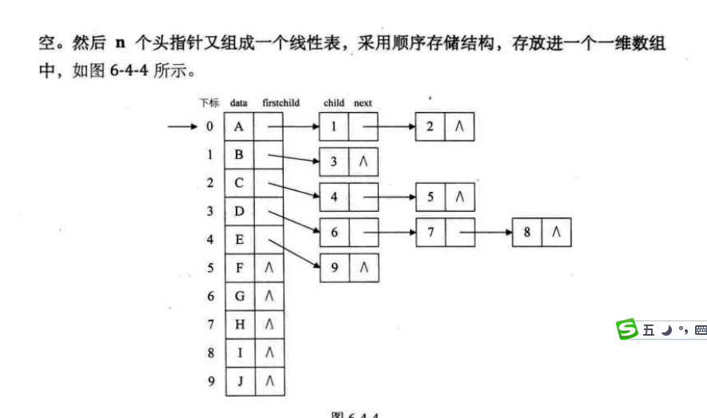  
    
    树的双亲表示法+孩子表示法   
    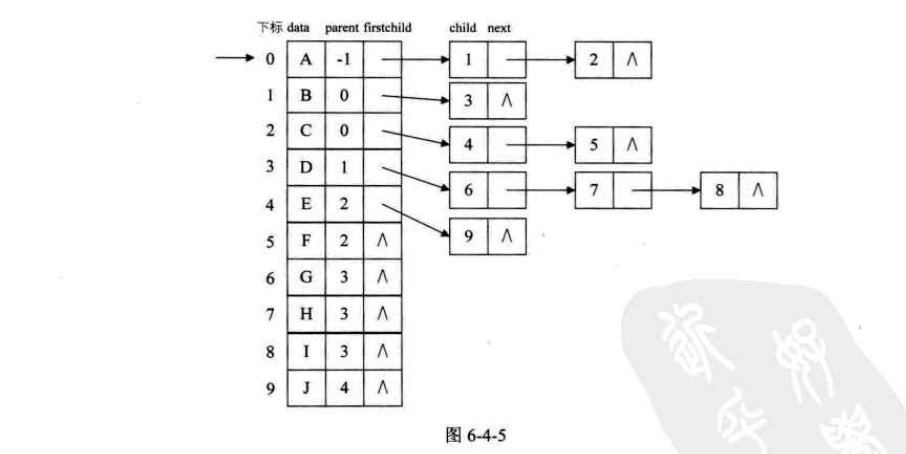     
    
    [测试源码](tree2.c)  
    
- 孩子兄弟表示    

    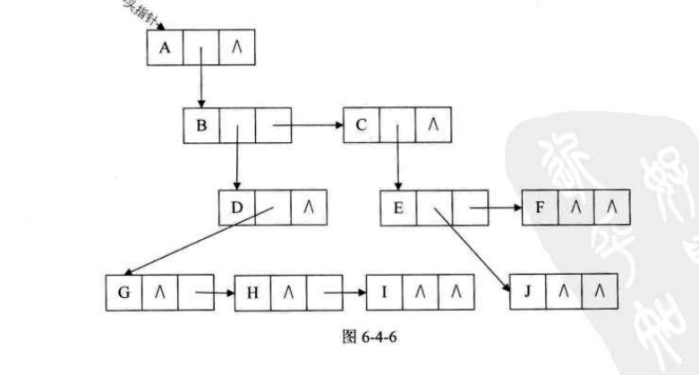   
    
    二叉树  
    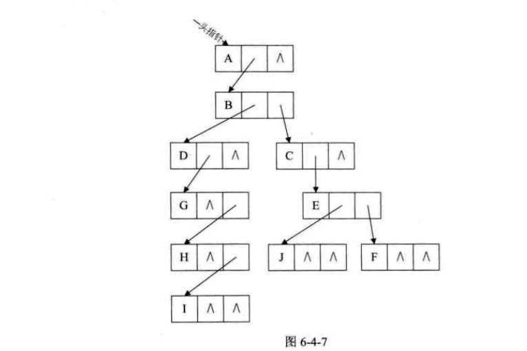  
    
    [treetest](tree3.c)  
    
    折半查找法  
    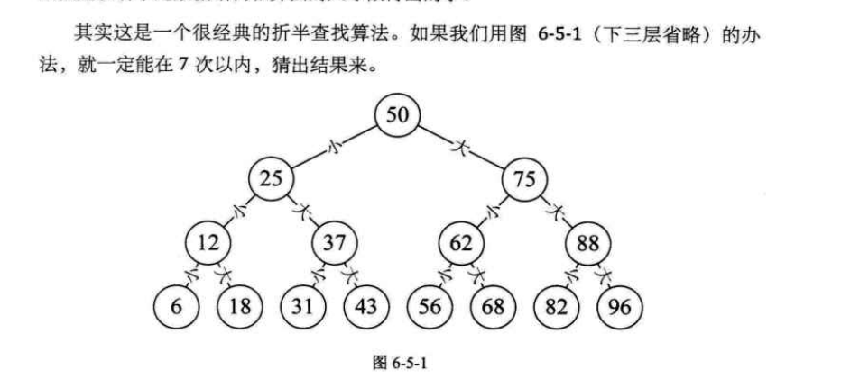  
    
- 二叉树【Binary Tree】  
    由N个结点组成的有限集合，由根结点和两棵互不相交，分别称为根结点的左子树和右子树的二叉树组成   
    
    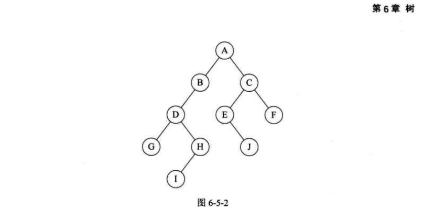 
    
    