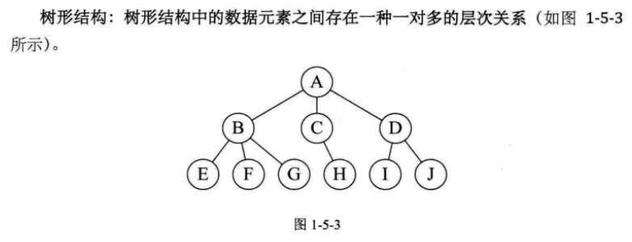
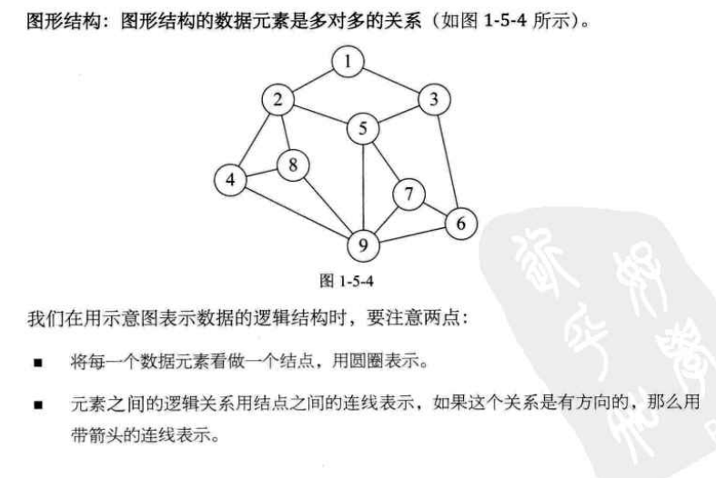

### 数据结构   
【内容摘自大话数据结构和算法】  
- 描述事物的符号，能被计算机操作的对象，并能被其识别，并输入到计算机处理的符号  
集合 

- 数据元素  【如人，狗，鱼，牛，马】   
 是组成数据的有意义的基本单位，在计算机整体处理也可作为记录    
 
- 数据项   
 数据元素有若干个数据项目构成   
 类似人【年龄，性别，眼，手，脚，头...】   
 
- 数据对象  【一堆人，一堆牛，一堆人，数据项是一样的都有性别，年龄，身高】      
 是性质相同的数据元素集合  【具有相同的数据项】 

- 数据结构  
 是相互之间存在一种或多种关系的数据元素的集合     
 
 - 逻辑结构  【数据对象中数据元素之间的相互关系】      
   - 集合结构  
     它们同属于一个集合，数据元素之间没有任何关系     
       
     
   - 线性结构  
     它们是之间是1对1的关系   
       
     
   - 树形结构  
     它们之间存在1对多的关系   
         
     
   - 图形结构  
     它们之间存在多对多的关系  
       
     
     
 - 物理结构  【是指数据的逻辑结构在计算机中的存储形式】   
     
     