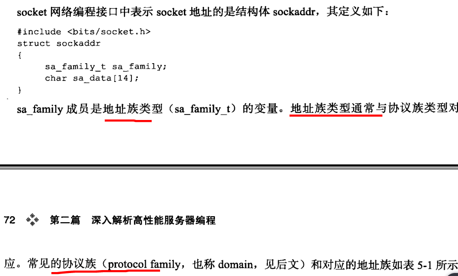
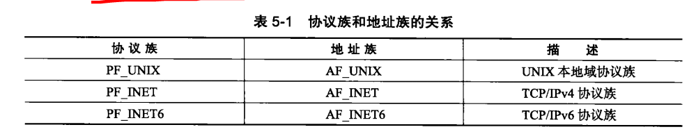
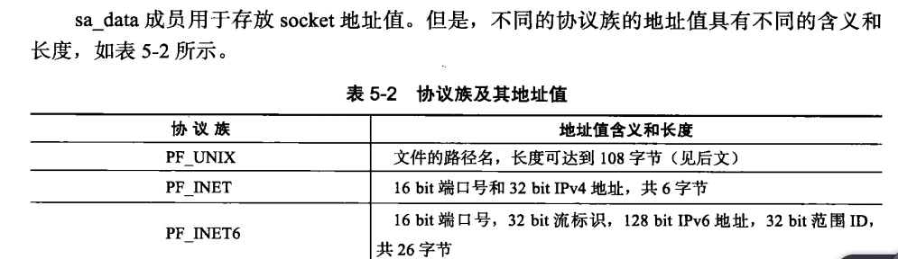
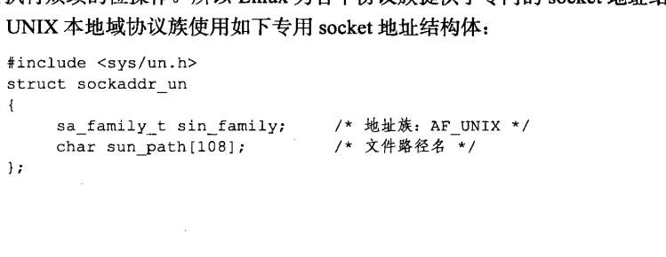
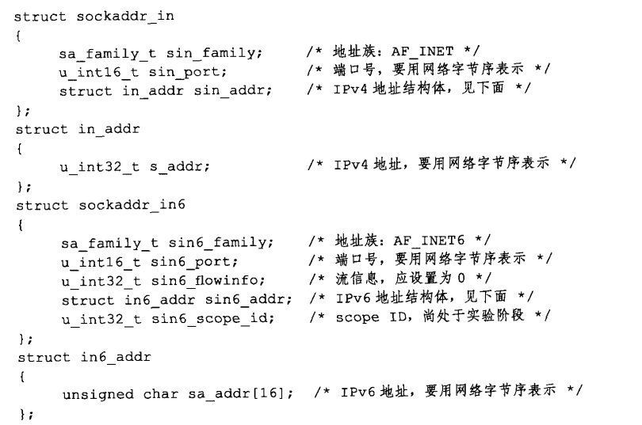
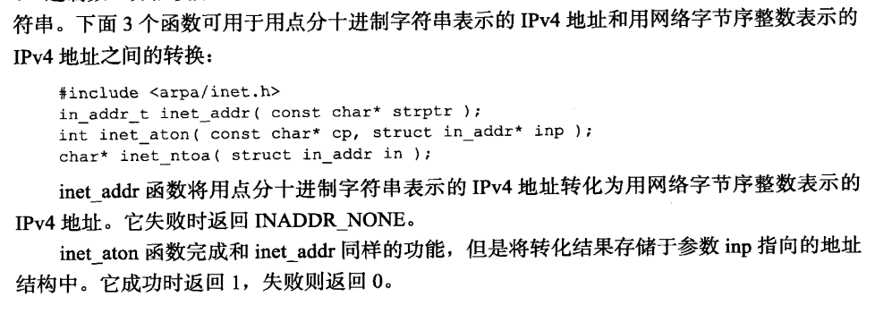
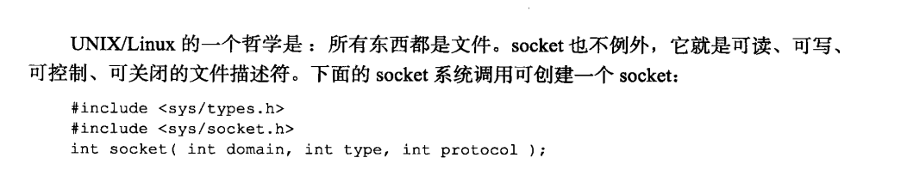
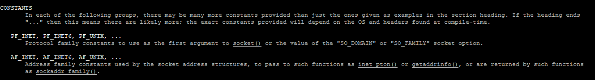
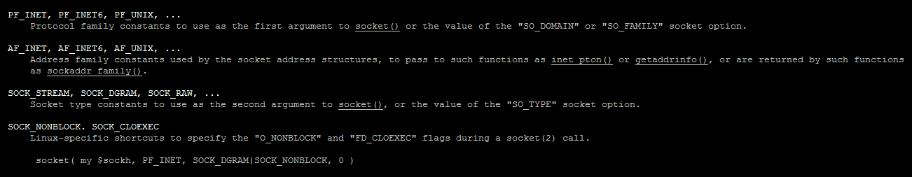

### 网络API接口  
- socket 地址API  
    - 主机字节序和网络字节序   
    大端和小端是指数据在内存中的存储模式，它由 CPU 决定：
    1) 大端模式（Big-endian）是指将数据的低位（比如 1234 中的 34 就是低位）放在内存的高地址上，而数据的高位（比如 1234 中的 12 就是高位）放在内存的低地址上。这种存储模式有点儿类似于把数据当作字符串顺序处理，地址由小到大增加，而数据从高位往低位存放。    
    
    2) 小端模式（Little-endian）是指将数据的低位放在内存的低地址上，而数据的高位放在内存的高地址上。这种存储模式将地址的高低和数据的大小结合起来，高地址存放数值较大的部分，低地址存放数值较小的部分，这和我们的思维习惯是一致，比较容易理解。   
    
    小端字节序为主机字节序
    大端字节序为网络字节序  
    主要是为了2台主机相互传输数据  
    小端机要转换，大端机不用转换  
    数据在发送之前先转换为网络字节序再发送    
    
    - 通用 socket 地址   
        
    地址族与协议族  
      
    
    协议族以对应的值  
      
    
    - 专用 socket 地址  
        - unix 本地域协议族使用专用的socket地址  
        
        - ipv4,ipv6协议族专用socket地址  
          
        
    - IP地址转换函数     
            
        
    - 创建socket    
            
        
        - socket支持的协议族  
         linux man socket   
             
        - socket 的地址族，协议族，服务类型  
          
        
        协议族：PF_UNIX PF_ANET PX_ANET6
        地址族：AF_UNIX AF_ANET AF_ANET6
        服务类型：SOCKET_STREAM 字节流  tcp
                 SOCKET_DGRAM 数据服   udp  
                 
        linux 高版本都支持服务类型与上SOCKET_NONBLOCK  
        SOCKET_CLOEXEC表示创建的socket为非阻塞的，以及  
        调用fork创建子进程时在子进程中关闭该socket   
        
        socket创建成功返回socket文件描述符，错误返回   
        -1及设置errno  
    
- socket 基础API  

- 网络信息API  