### 网络API接口  
- socket 地址API  
    - 主机字节序和网络字节序   
    大端和小端是指数据在内存中的存储模式，它由 CPU 决定：
    1) 大端模式（Big-endian）是指将数据的低位（比如 1234 中的 34 就是低位）放在内存的高地址上，而数据的高位（比如 1234 中的 12 就是高位）放在内存的低地址上。这种存储模式有点儿类似于把数据当作字符串顺序处理，地址由小到大增加，而数据从高位往低位存放。    
    
    2) 小端模式（Little-endian）是指将数据的低位放在内存的低地址上，而数据的高位放在内存的高地址上。这种存储模式将地址的高低和数据的大小结合起来，高地址存放数值较大的部分，低地址存放数值较小的部分，这和我们的思维习惯是一致，比较容易理解。   
    
    小端字节序为主机字节序
    大端字节序为网络字节序  
    主要是为了2台主机相互传输数据  
    小端机要转换，大端机不用转换  
    数据在发送之前先转换为网络字节序再发送    
    
    - 通用 socket 地址   
        
    地址族与协议族  
      
    
    协议族以对应的值  
      
    
    - 专用 socket 地址  
        - unix 本地域协议族使用专用的socket地址  
        
        - ipv4,ipv6协议族专用socket地址  
          
        
    - IP地址转换函数     
            
        
    - 创建socket    
            
        
        - socket支持的协议族  
         linux man socket   
             
        - socket 的地址族，协议族，服务类型  
          
        
        协议族：PF_UNIX PF_ANET PX_ANET6
        地址族：AF_UNIX AF_ANET AF_ANET6
        服务类型：SOCKET_STREAM 字节流  tcp
                 SOCKET_DGRAM 数据服   udp  
                 
        linux 高版本都支持服务类型与上SOCKET_NONBLOCK  
        SOCKET_CLOEXEC表示创建的socket为非阻塞的，以及  
        调用fork创建子进程时在子进程中关闭该socket   
        
        socket创建成功返回socket文件描述符，错误返回   
        -1及设置errno  
        
    - 命名socket     
      创建socket成功后，绑定一个socket地址就叫命名  
      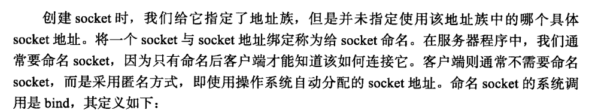    
      
      - socket 地址绑定函数   
      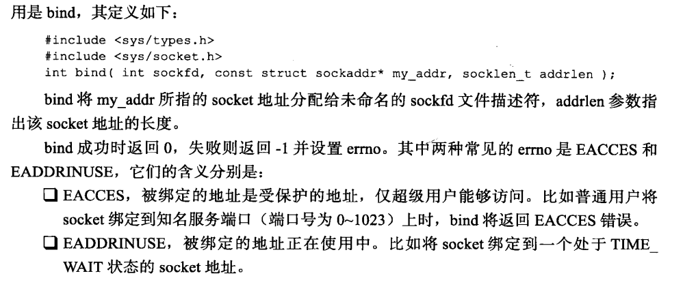    
      
    - 监听 socket     
      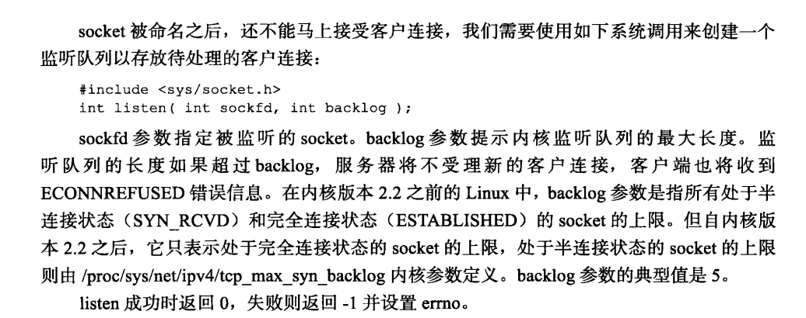    
      
    - 接受连接   
      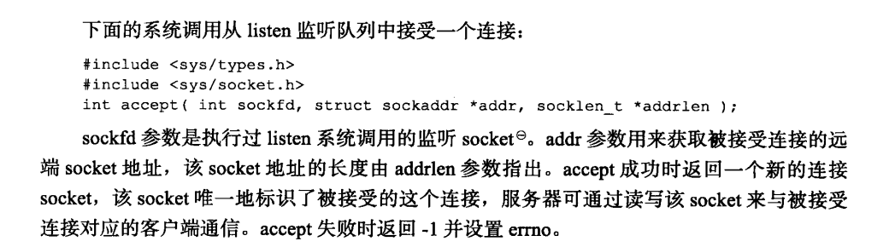    
      
      socket 测试代码【本人亲自实验】  
      ```c 
      #include <sys/socket.h> socket库
      #include <netinet/in.h> 
      #include <arpa/inet.h> ip地址转换
      #include <signal.h> 信号 
      #include <unistd.h>  定时睡眠
      #include <stdlib.h>  标准库
      #include <assert.h>
      #include <stdio.h>
      #include <string.h>
      #include <libgen.h>  basename用  用于获取 shell \后面的字符
      #define FALSE 0
      #define TRUE 1
      static int stop = FALSE;
      
      static void handle_term(int sig)
      {
          stop = TRUE;
      }
      
      int main(int argc,char *argv[])
      {
          signal(SIGTERM,handle_term);  //信号监听
          if (argc>=3){
              printf("useage:%s ip_address port _number backog\n",basename(argv[0]));
      
          }
          const char *ip = argv[1];
      
          int port = atoi(argv[2]);//将字符转换为整数
          int backlog = atoi(argv[3]);
          int sock = socket(PF_INET,SOCK_STREAM,0);//创建一个socket PF_INET为协议族  SOCKET_STREAM为服务类型
          assert(sock>=0);//声明  为false报错
      
          struct sockaddr_in address;//tcp/ipv4地址
      
          bzero(&address,sizeof(address));//地址清零
          address.sin_family = AF_INET;//tcp/ipv4地址族 跟协议族对应
      
          inet_pton(AF_INET,ip,&address.sin_addr);//将输入的点分十进制ip地址转换为二进制，并保存在地址
          address.sin_port = htons(port);
          int ret = bind(sock,(struct sockaddr *)&address,sizeof(address));//绑定地址
      
          assert(ret!=-1);
         
          ret = listen(sock,backlog);//监听socket 进入LISTEN状态
      
          assert(ret!=-1);
      
          while(!stop){
              sleep(1);//当用户按下终止时如ctrl+c,信号会被程序捕获到
          }
      
          close(sock);//关闭socket
      
          return 0;
      }

      ```    
	结果   
	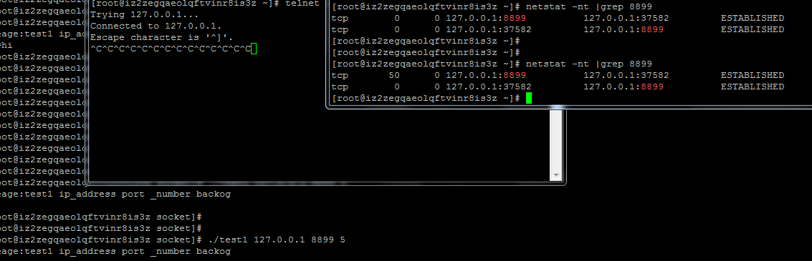    
    
	
	接受连接代码测试     
	```c 
	#include <stdio.h>
	#include <stdlib.h>
	#include <string.h>
	#include <libgen.h>
	#include <netinet/in.h>
	#include <sys/socket.h>
	#include <arpa/inet.h>
	#include <assert.h>
	#include <unistd.h>
	#include <error.h>
	int main(int argc,char *argv[])
	{

		if(argc<2){
			printf("usage:%s ip and port\n",basename(argv[0]));
		}

		const char *ip = argv[1];
		const int port = atoi(argv[2]);//数据类型转换

		struct sockaddr_in address;//tcp/ipv4地址
		bzero(&address,sizeof(address));//置0

		address.sin_family = AF_INET;//地址族  一般和协议族对应

		address.sin_port = htons(port);//host to network short int
		inet_pton(AF_INET,ip,&address.sin_addr);//地址

		int sock = socket(PF_INET,SOCK_STREAM,0);//创建一个基于tcp/ipv4的字节流sock

		assert(sock>=0);

		int ret = bind(sock,(struct sockaddr*)&address,sizeof(address));//将地址绑定此sock

		assert(ret!=-1);

		ret = listen(sock,5);//监听sock进入LISTEN状态待客户端连接，会进入内核连接等待队列里
		assert(ret!=-1);

		sleep(30);

		struct sockaddr_in client;//客户端地址
		socklen_t client_addrlenth = sizeof(client);
			int confd = accept(sock,(struct sockaddr*)&client,(socklen_t*)&client_addrlenth);//从内核等待队列里取出一个客户端连接

		if(confd<0){
			printf("error is %d\n",error);
		}else{
			char remote[INET_ADDRSTRLEN];
			printf("ip is %s,port is %d\n",inet_ntop(AF_INET,&client.sin_addr,remote,INET_ADDRSTRLEN),ntohs(client.sin_port));
			close(confd);
		}
		close(sock);


		return 0;
	}

	```   
	测试结果【tcpdump工具抓取通信过程】 
	```php 
	[root@iz2zegqaeolqftvinr8is3z ~]# tcpdump -ntx -i lo      
tcpdump: verbose output suppressed, use -v or -vv for full protocol decode    
listening on lo, link-type EN10MB (Ethernet), capture size 65535 bytes     
IP 127.0.0.1.57352 > 127.0.0.1.8897: Flags [S], seq 1730669501, win 43690, options [mss 65495,sackOK,TS val 1425002453 ec                                               r 0,nop,wscale 7], length 0   
        0x0000:  4510 003c 2468 4000 4006 1842 7f00 0001   
        0x0010:  7f00 0001 e008 22c1 6727 ebbd 0000 0000  
        0x0020:  a002 aaaa fe30 0000 0204 ffd7 0402 080a  
        0x0030:  54ef cfd5 0000 0000 0103 0307   
IP 127.0.0.1.8897 > 127.0.0.1.57352: Flags [S.], seq 4203933173, ack 1730669502, win 43690, options [mss 65495,sackOK,TS                                                val 1425002453 ecr 1425002453,nop,wscale 7], length 0   
        0x0000:  4500 003c 0000 4000 4006 3cba 7f00 0001  
        0x0010:  7f00 0001 22c1 e008 fa92 edf5 6727 ebbe  
        0x0020:  a012 aaaa fe30 0000 0204 ffd7 0402 080a   
        0x0030:  54ef cfd5 54ef cfd5 0103 0307  
IP 127.0.0.1.57352 > 127.0.0.1.8897: Flags [.], ack 1, win 342, options [nop,nop,TS val 1425002453 ecr 1425002453], lengt                                               h 0   
        0x0000:  4510 0034 2469 4000 4006 1849 7f00 0001  
        0x0010:  7f00 0001 e008 22c1 6727 ebbe fa92 edf6  
        0x0020:  8010 0156 fe28 0000 0101 080a 54ef cfd5  
        0x0030:  54ef cfd5   
IP 127.0.0.1.8897 > 127.0.0.1.57352: Flags [F.], seq 1, ack 1, win 342, options [nop,nop,TS val 1425022283 ecr 1425002453                                               ], length 0   
        0x0000:  4500 0034 2223 4000 4006 1a9f 7f00 0001  
        0x0010:  7f00 0001 22c1 e008 fa92 edf6 6727 ebbe  
        0x0020:  8011 0156 fe28 0000 0101 080a 54f0 1d4b  
        0x0030:  54ef cfd5
IP 127.0.0.1.57352 > 127.0.0.1.8897: Flags [F.], seq 1, ack 2, win 342, options [nop,nop,TS val 1425022283 ecr 1425022283                                               ], length 0  
        0x0000:  4510 0034 246a 4000 4006 1848 7f00 0001  
        0x0010:  7f00 0001 e008 22c1 6727 ebbe fa92 edf7  
        0x0020:  8011 0156 fe28 0000 0101 080a 54f0 1d4b  
        0x0030:  54f0 1d4b

	```    
	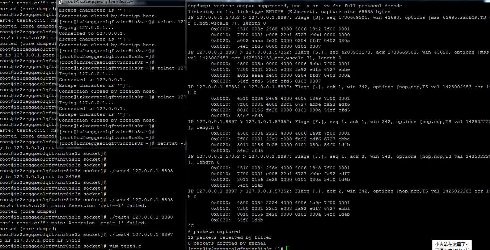       
	
	
TCP连接与发送和接受数据及发送/接收标志位   
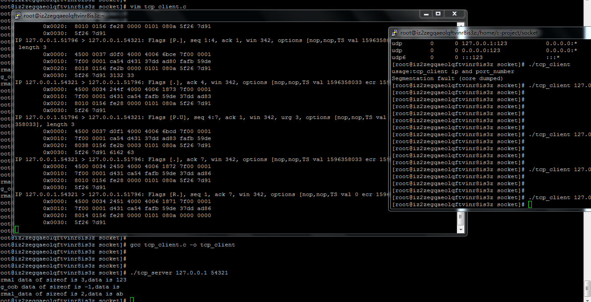   
服务器端源码  
```c 
#include <stdio.h>
#include <string.h>
#include <stdlib.h>
#include <libgen.h>
#include <sys/socket.h>
#include <assert.h>
#include <netinet/in.h>
#include <arpa/inet.h>
#include <error.h>
#include <unistd.h>
#define BUF_SIZE 1024
int main(int argc,char *argv[])
{
        if(argc<2){
                printf("usage:%s port and port_number\n",basename(argv[0]));
        }

        const char *ip=argv[1];
        const int port=atoi(argv[2]);

        struct sockaddr_in address;
        bzero(&address,sizeof(address));

        address.sin_family = AF_INET;
        address.sin_port = htons(port);
        inet_pton(AF_INET,ip,&address.sin_addr);

        int sock = socket(PF_INET,SOCK_STREAM,0);
        assert(sock>0);

        int ret = bind(sock,(struct sockaddr*)&address,sizeof(address));
        assert(ret!=1);
        ret = listen(sock,5);
        assert(ret!=-1);
        struct sockaddr_in client;
        socklen_t client_addrlen = sizeof(client);
        int confd = accept(sock,(struct sockaddr*)&client,&client_addrlen);
        if(confd<0){
                printf("error is %s\n",error);
        }else{
                char buffer[BUF_SIZE];
                memset(buffer,'\0',BUF_SIZE);
                int ret = recv(confd,buffer,BUF_SIZE-1,0);
                printf("normal data of sizeof is %d,data is %s\n",ret,buffer);
                memset(buffer,0,BUF_SIZE);
                ret = recv(confd,buffer,BUF_SIZE-1,MSG_OOB);
                printf("msg_oob data of sizeof is %d,data is %s\n",ret,buffer);
                memset(buffer,0,BUF_SIZE);
                ret = recv(confd,buffer,BUF_SIZE-1,0);
                printf("normal_data of sizeof is %d,data is %s\n",ret,buffer);

                close(confd);
        }
        close(sock);

        return 0;
}

```   

客户端源码   
```c 
#include <stdio.h>
#include <stdlib.h>
#include <libgen.h>
#include <sys/socket.h>
#include <arpa/inet.h>
#include <netinet/in.h>
#include <assert.h>
#include <string.h>
int main(int argc,char *argv[])
{
        if(argc<2){
                printf("usage:%s ip and port_number\n",basename(argv[0]));
        }

        const char *ip = argv[1];
        const int port = atoi(argv[2]);

        struct sockaddr_in server_address;
        bzero(&server_address,sizeof(server_address));

        server_address.sin_family = AF_INET;
        server_address.sin_port = htons(port);
        inet_pton(AF_INET,ip,&server_address.sin_addr);

        int sock = socket(PF_INET,SOCK_STREAM,0);
        assert(sock>0);

        if(connect(sock,(struct sockaddr *)&server_address,sizeof(server_address))<0){
                printf("connect failed\n");
        }else{
                const char *oob_data="abc";
                const char *normal_data="123";
                send(sock,normal_data,strlen(normal_data),0);
                send(sock,oob_data,strlen(oob_data),MSG_OOB);
                send(sock,normal_data,strlen(normal_data),0);
        }
        close(sock);
        return 0;
}

```    
	

      

  - socket API  
    主机字节序和网络字节序【大端和小端】转换函数   
    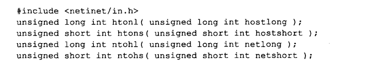  
    
    通用sockaddr地址结构体  
    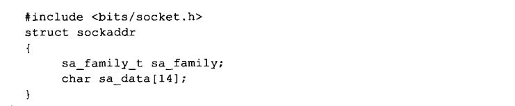  
    
    专用sockaddr_unix地址结构体  
    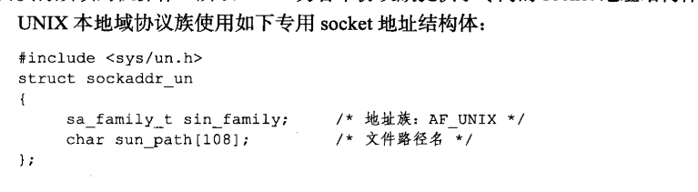  
    
    专用sockaddr_in地址结构体  
    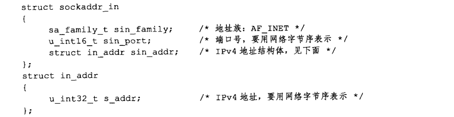  
    
    专用sockaddr_in6地址结构体   
    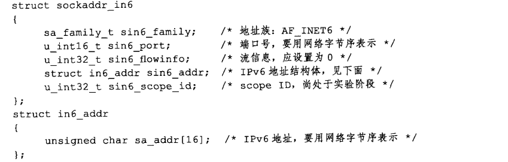

    IP地址转换函数  
    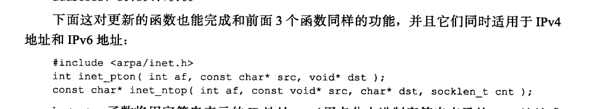  
    
    sock创建函数  
    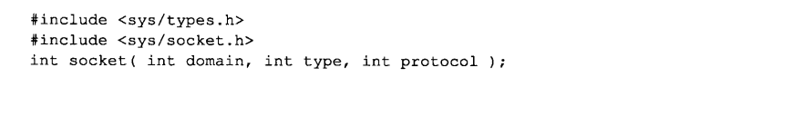  
    
    sock命名函数  
    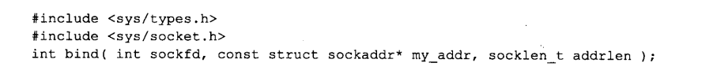  
    
    sock监听函数  
    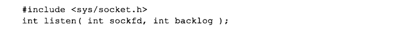   
    
    sock接收函数  
      
    
    socket连接函数   
    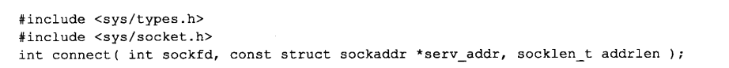  
    
    sock关闭连接函数  
       
    
    数据读写函数  
    tcp数据读写函数  
    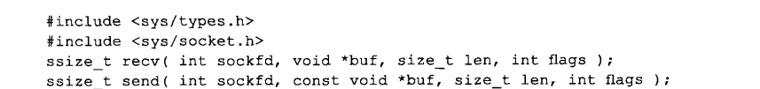  
    
    udp数据读写函数  
    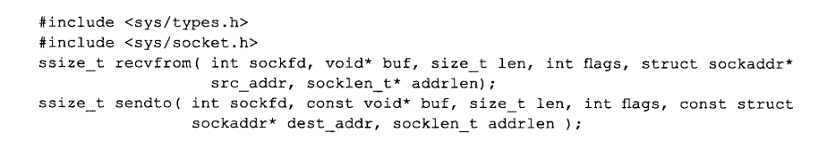   
    
    通用数据读写函数  
    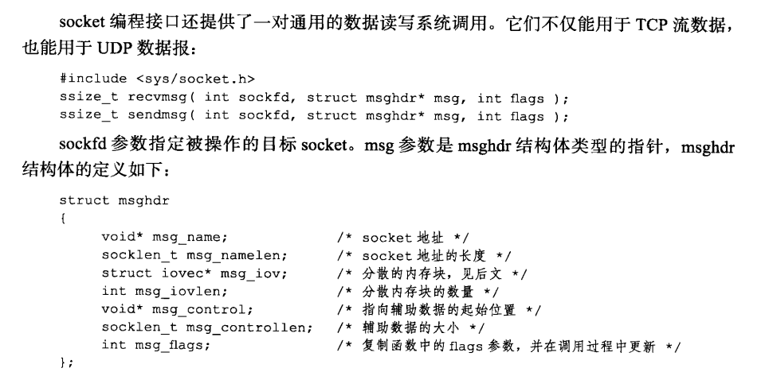  
    
    外带标记函数  
    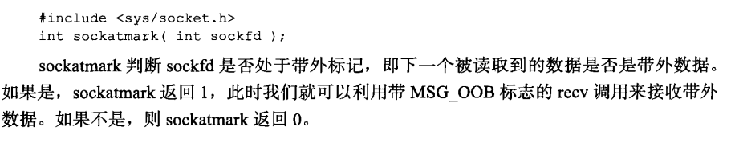  
    
    地址信息函数  
    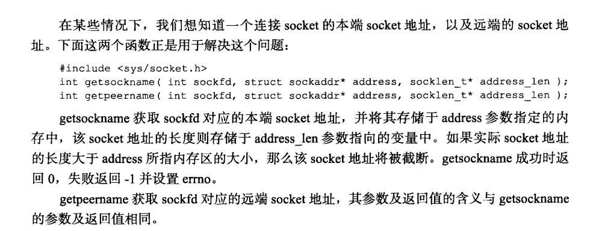    
    
    sock选项函数  
    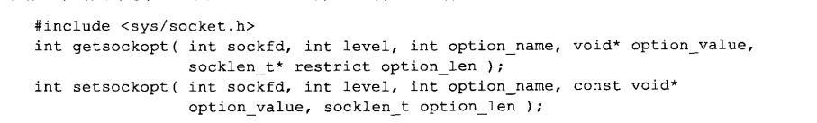
- socket 基础API  

- 网络信息API  
