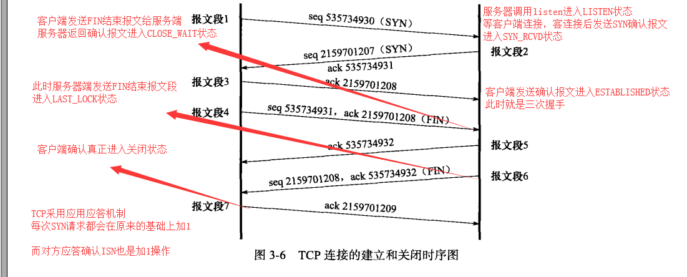

###tcp 连接状态
- 状态转移
    服务器通过listen系统调用进入LISTEN状态，等待客户端连接，客户端连接后放入系统内核
    等待队列，并发送一个SYN标志的确认报文段，此时进入SYN_RCVD状态，如果客户端返回一个应答确认报文段
    则进入了ESTABLISHED状态，即他们进入了连接状态，可以相互发送数据的状态

    客户端调用close/shutdown发送一个结束报文段给服务器，服务器返回确认报文段，此时进入CLOSE_WAIT
    状态，服务器也发送结束报文段给客户端的时候，此时进入LAST_LOCK状态，客户端返回确认报文段就会真的
    关闭连接了

    状态图
    

    客户端的状态转移说明
    客户端通过connect系统调用，connect会发送一个SYN连接报文段，此时进入SYN_SENT状态
    如果服务器
    1、目标端口不存在，但没有任何进程监听，此时可能会收到复位RST报文段，或是TIME_WAIT状态
    2、端口存在，但连接超时，没有收到服务器的确认报文段

    如果连接成功进入ESTABLISHED状态

    客户端发送FIN结束报文段的时候，进入FIN_WAIT1状态，如果服务器确认则进入FIN_WAIT2状态
    此时服务器已经是CLOSE_WAIT状态了，当服务器也发送FIN结束报文段的时候，客户端确认后进入TIME_WAIT
    状态